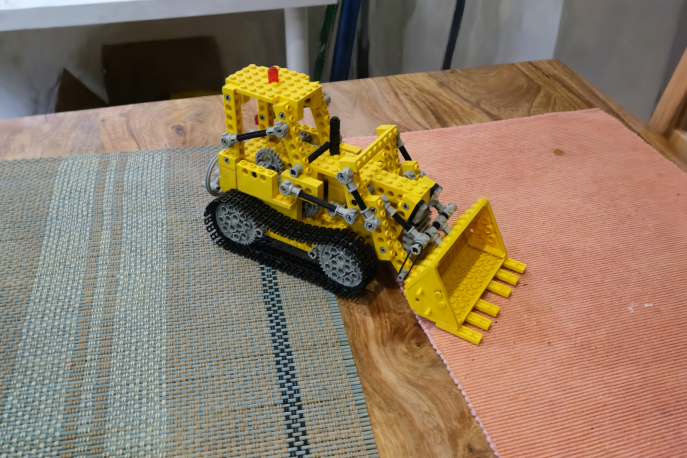
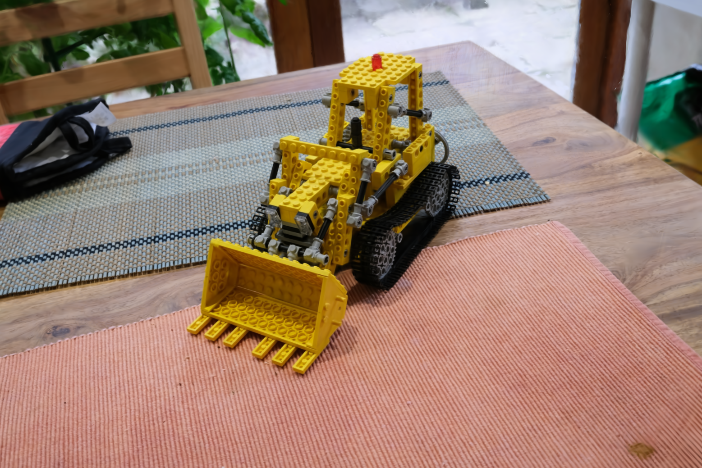
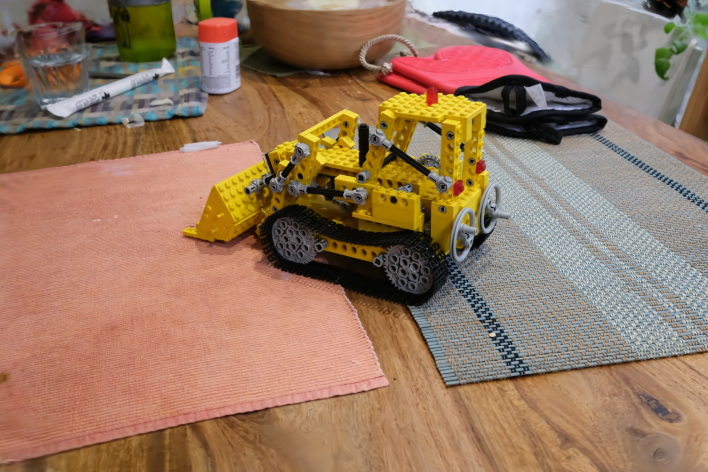

# 3D Gaussian Splatting for Real-Time Radiance Field Rendering

#### Inference code from the course [3D Gaussian Splatting from Scratch — PyTorch-Only](https://3dgaussiansplattingcourse.com).

## Usage

[Download the trained gaussians](https://drive.google.com/file/d/1NOx8dnD5_iz5dkuZuNzIpORRvhS87Zth/view?usp=sharing).
```commandline
$ pip3 install -r requirements.txt
$ python3 3dgs.py
```

## Results

#### Novel views rendered from the optimized 3DGS representation (after 7k training iterations)

               |   
:-------------------------:|:-------------------------:
  |  