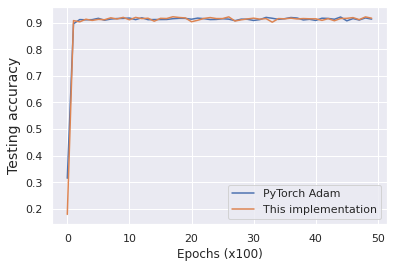

# Adam: A Method For Stochastic Optimization

Implementation in 100 lines of code of the paper [Adam](https://arxiv.org/abs/1412.6980).

## Usage

```commandline
$ pip3 install -r requirements.txt
$ python3 adam.py
```

## Results

#### Test accuracy


