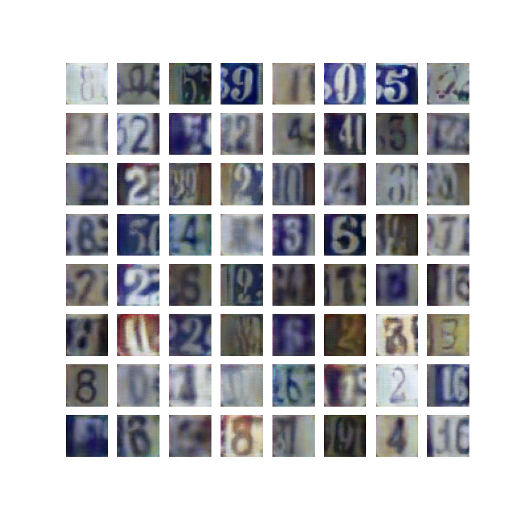

# Adversarially Learned Inference

Implementation in 100 lines of code of the paper [Adversarially Learned Inference](https://arxiv.org/abs/1606.00704).

## Usage

**Dataset:** [Download the training and testing datasets](http://ufldl.stanford.edu/housenumbers/).

```commandline
$ pip3 install -r requirements.txt
$ python3 ali.py
```

## Results

#### Visualization of samples from the trained model on the SVHN dataset. 


