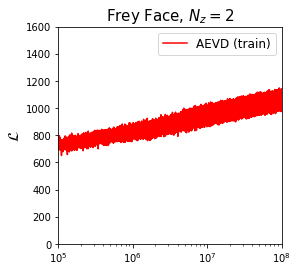
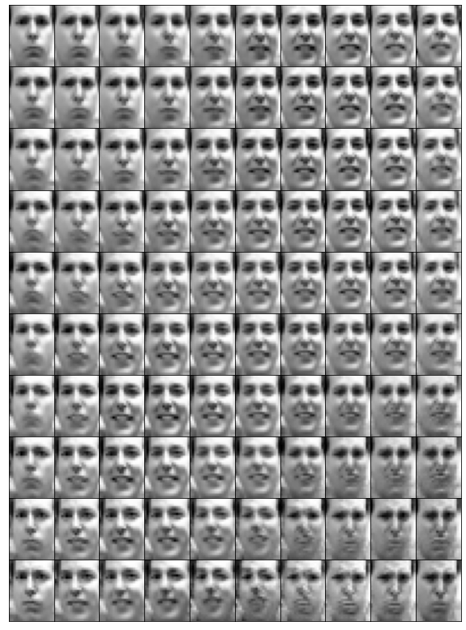

# Auto-Encoding Variational Bayes

Implementation in 100 lines of code of the paper [Auto-Encoding Variational Bayes](https://arxiv.org/abs/1312.6114).

## Results

#### Training loss

#### Learned data manifold

