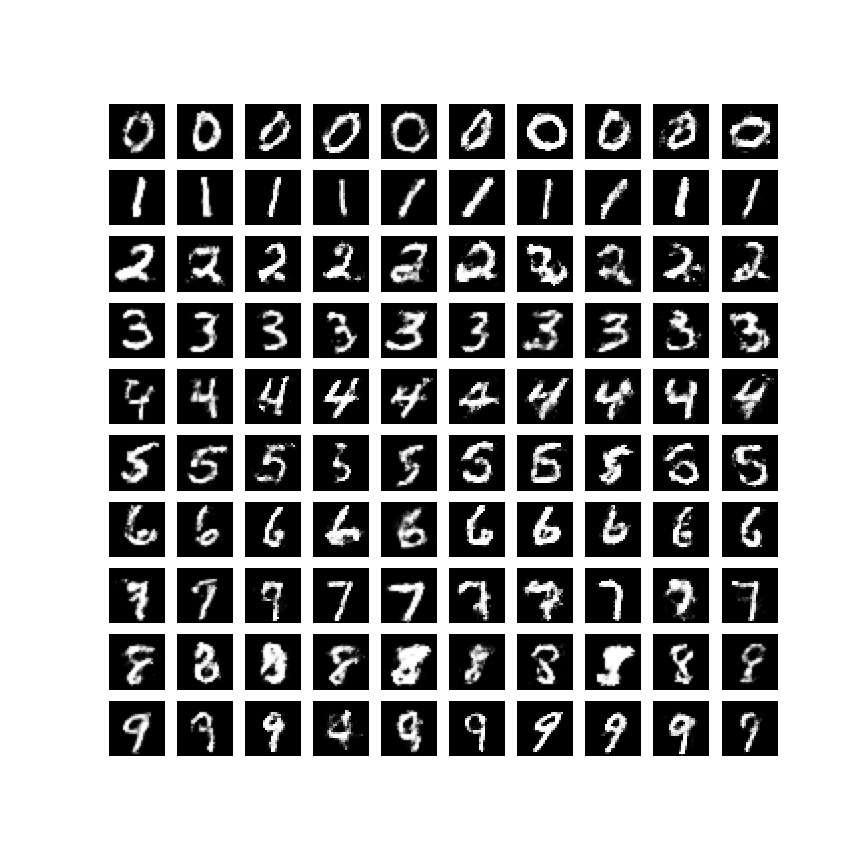

# Conditional Generative Adversarial Nets

Implementation in 100 lines of code of the paper [Conditional Generative Adversarial Nets](https://arxiv.org/abs/1411.1784).

## Usage

```commandline
$ pip3 install -r requirements.txt
$ python3 cgan.py
```

## Results

#### Generated MNIST digits, each row conditioned on one label.


