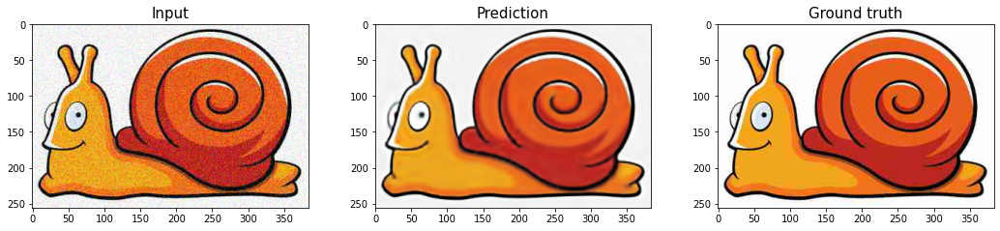

# Deep Image Prior


Implementation in 100 lines of code of the paper [Deep Image Prior](https://arxiv.org/abs/1711.10925).

## Usage

```commandline
$ pip3 install -r requirements.txt
$ python3 deep_image_prior.py
```

## Results


#### Blind restoration.


 
