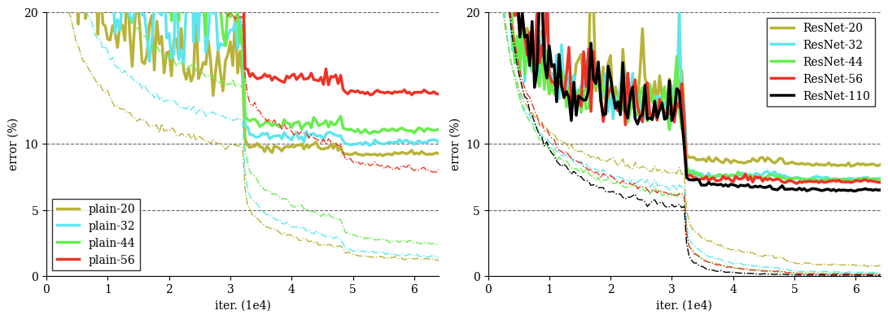

# Deep Residual Learning for Image Recognition


Implementation in 100 lines of code of the paper [Deep Residual Learning for Image Recognition](https://arxiv.org/abs/1512.03385).

## Usage

```commandline
$ pip3 install -r requirements.txt
$ python3 resnet.py
```

## Results


#### Training on CIFAR-10. Dashed lines denote training error, and bold lines denote testing error. Left: plain networks. Right: ResNets.


 
