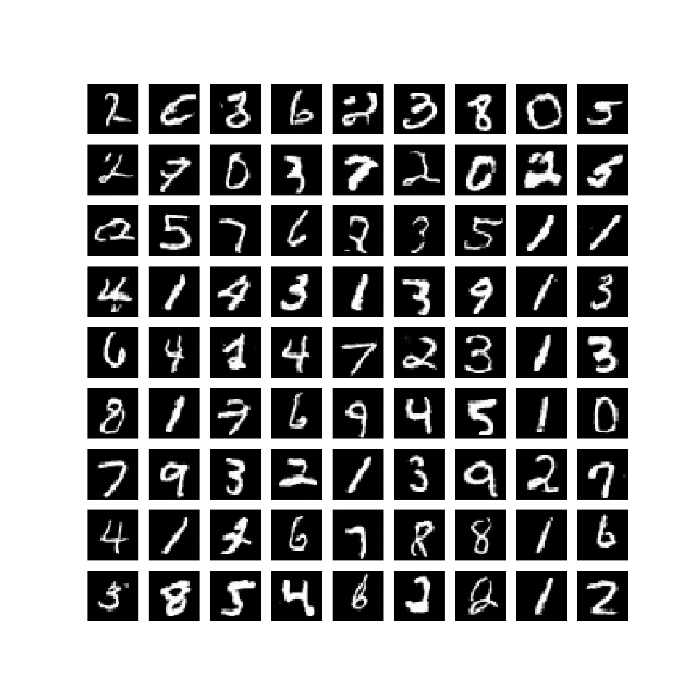

# Denoising Diffusion Implicit Models


Implementation in 100 lines of code of the paper [Denoising Diffusion Implicit Models](https://arxiv.org/abs/2010.02502).

## Usage

```commandline
$ pip3 install -r requirements.txt
$ python3 ddim.py
```

## Results


#### Generated samples


 
