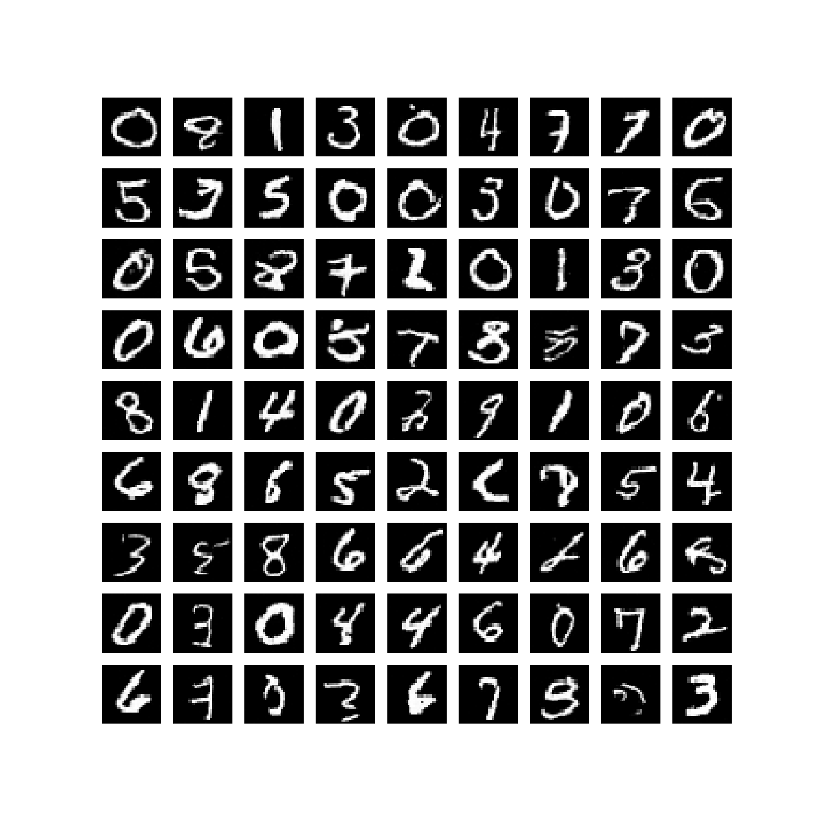

# Denoising Diffusion Probabilistic Models Thermodynamics


#### Code from the course [Introduction to Diffusion Models](https://www.udemy.com/course/diffusion-models/?referralCode=CA3F0C5DAA29F449F6DD).

## Usage

```commandline
$ pip3 install -r requirements.txt
$ python3 diffusion_models.py
```

## Results


#### MNIST generated samples


 
