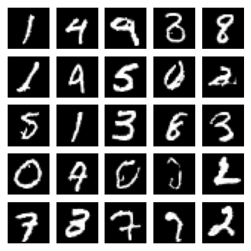

# Code for *Density estimation using Real NVP*

Implementation in 100 lines of code of the paper [Density estimation using Real NVP](https://arxiv.org/abs/1605.08803).

## Usage

```commandline
$ pip3 install -r requirements.txt
$ python3 real_nvp.py
```

## Results

#### Visualization of samples from the model. 


