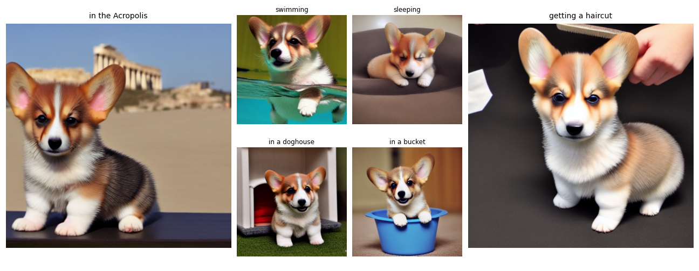

# DreamBooth: Fine Tuning Text-to-Image Diffusion Models for Subject-Driven Generation

Implementation in 100 lines of code of the paper [DreamBooth: Fine Tuning Text-to-Image Diffusion Models for Subject-Driven Generation](https://arxiv.org/abs/2208.12242).

## Usage

```commandline
$ pip3 install -r requirements.txt
$ python3 dreambooth.py
```

## Results


#### DreamBooth subject generation in novel contexts.


 
