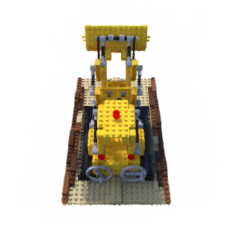

# FastNeRF: High-Fidelity Neural Rendering at 200FPS


Implementation in 100 lines of code of the paper [FastNeRF: High-Fidelity Neural Rendering at 200FPS](https://arxiv.org/abs/2103.10380).

## Usage

**Dataset:** [Download the training and testing datasets](https://drive.google.com/drive/folders/18bwm-RiHETRCS5yD9G00seFIcrJHIvD-?usp=sharing).
```commandline
$ pip3 install -r requirements.txt
$ python3 fast_nerf.py
```

## Results


#### Novel views rendered from the optimized model using a low-resolution cache (k=192, l=128)


               |   
:-------------------------:|:-------------------------:
  |  


## What is not implemented

- Hierarchical volume sampling
- Nearest neighbour interpolation for Fpos and trilinear sampling for Fview