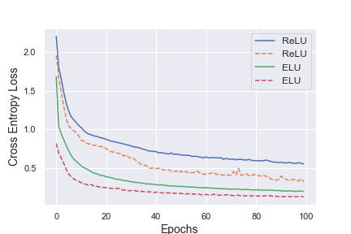

# Fast and Accurate Deep Network Learning by Exponential Linear Units (ELUs)

Implementation in 100 lines of code of the paper [Fast and Accurate Deep Network Learning by Exponential Linear Units (ELUs)](https://arxiv.org/abs/1511.07289).

## Usage

```commandline
$ pip3 install -r requirements.txt
$ python3 elu.py
```

## Results


#### ELU network evaluated at MNIST. 


 
