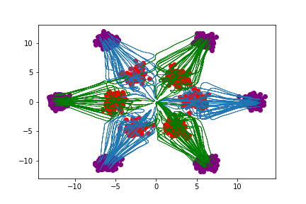

# Flow Straight and Fast: Learning to Generate and Transfer Data with Rectified Flow

Implementation in 100 lines of code of the paper [Flow Straight and Fast: Learning to Generate and Transfer Data with Rectified Flow](https://arxiv.org/abs/2209.03003).

## Usage

```commandline
$ pip3 install -r requirements.txt
$ python3 flow_straight_and_fast.py
```

## Results

#### Rectified flows fitted with neural networks trained with different L2 penalty.


