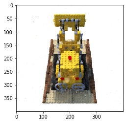
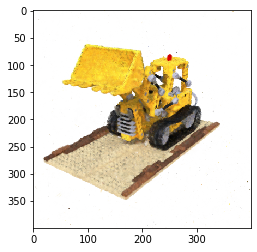
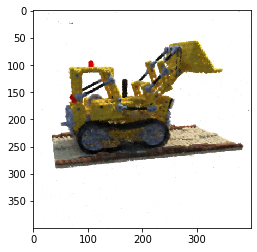
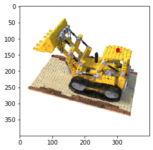

# Fourier Features Let Networks Learn High Frequency Functions in Low Dimensional Domains

Implementation in 100 lines of code of the paper [Fourier Features Let Networks Learn High Frequency Functions in Low Dimensional Domains](https://arxiv.org/abs/2006.10739).

## Usage

**Dataset:** [Download the training and testing datasets](https://drive.google.com/drive/folders/18bwm-RiHETRCS5yD9G00seFIcrJHIvD-?usp=sharing).
```commandline
$ pip3 install -r requirements.txt
$ python3 inverse_rendering.py
```

## Results


#### Novel views rendered from the optimized model


               |   
:-------------------------:|:-------------------------:
  |  


## Credits

- The datasets were generated with the code from [kwea123/nerf_pl](https://github.com/kwea123/nerf_pl/blob/master/datasets/blender.py).
