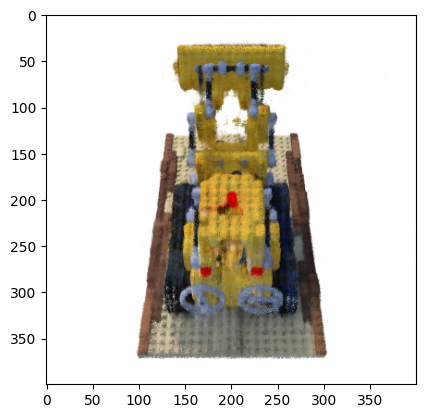
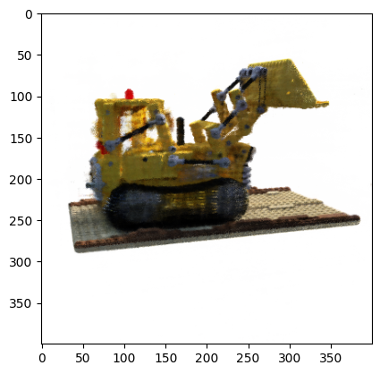
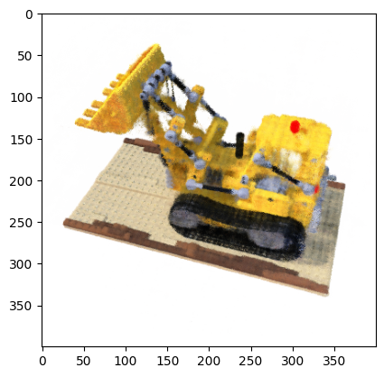

# FreeNeRF: Improving Few-shot Neural Rendering with Free Frequency Regularization

Implementation in 100 lines of code of the paper [FreeNeRF: Improving Few-shot Neural Rendering with Free Frequency Regularization](https://arxiv.org/abs/2303.07418).

## Usage

**Dataset:** [Download the training and testing datasets](https://drive.google.com/drive/folders/18bwm-RiHETRCS5yD9G00seFIcrJHIvD-?usp=sharing).
```commandline
$ pip3 install -r requirements.txt
$ python3 freenerf.py
```

## Results


#### Novel views rendered from a model optimized on only 8 training views


               |   
:-------------------------:|:-------------------------:
  |  
