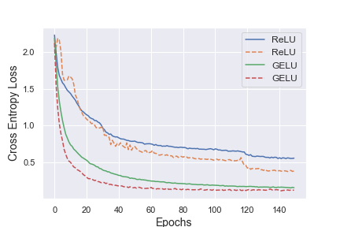

# Gaussian Error Linear Units (GELUs)

Implementation in 100 lines of code of the paper [Gaussian Error Linear Units (GELUs)](https://arxiv.org/abs/1606.08415).

## Usage

```commandline
$ pip3 install -r requirements.txt
$ python3 gelu.py
```

## Results


#### GELU network evaluated at MNIST. 


 
