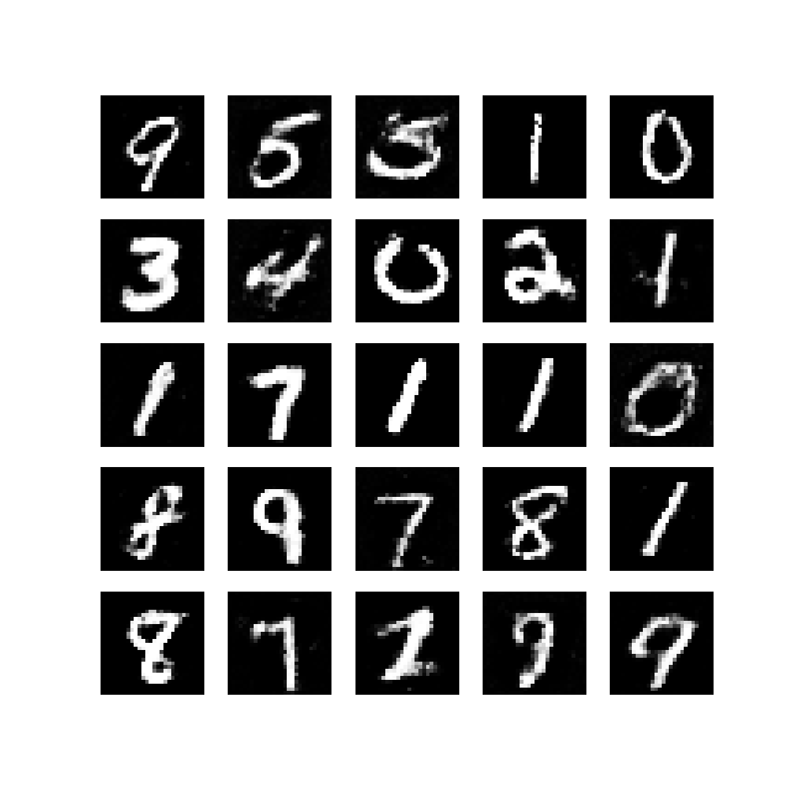

# Generative Adversarial Networks

Implementation in 100 lines of code of the paper [Generative Adversarial Networks](https://arxiv.org/abs/1406.2661).

## Usage

```commandline
$ pip3 install -r requirements.txt
$ python3 GANs.py
```

## Results

#### Visualization of samples from the model. 


