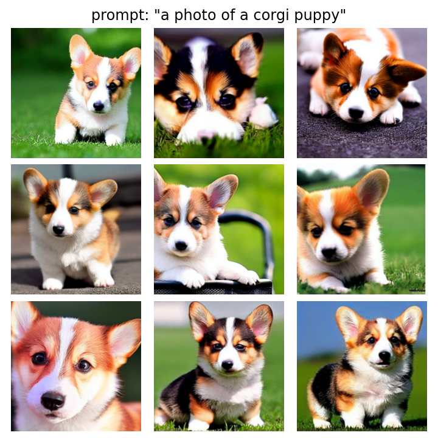

# High-Resolution Image Synthesis with Latent Diffusion Models


Implementation in 100 lines of Stable Diffusion v1-5, inference only (no training).

## Usage

```commandline
$ pip3 install -r requirements.txt
$ python3 sample.py
```

## Results


#### Unbiased samples from the model


 
