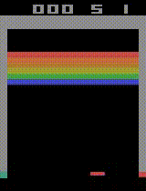
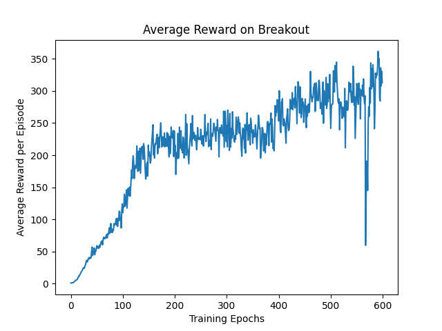

# Playing Atari with Deep Reinforcement Learning

Implementation in 100 lines of code of the paper [Playing Atari with Deep Reinforcement Learning](https://arxiv.org/abs/1312.5602).

## Usage

```commandline
$ pip3 install -r requirements.txt
$ python3 dqn.py
```

## Results



#### Average reward on Breakout


