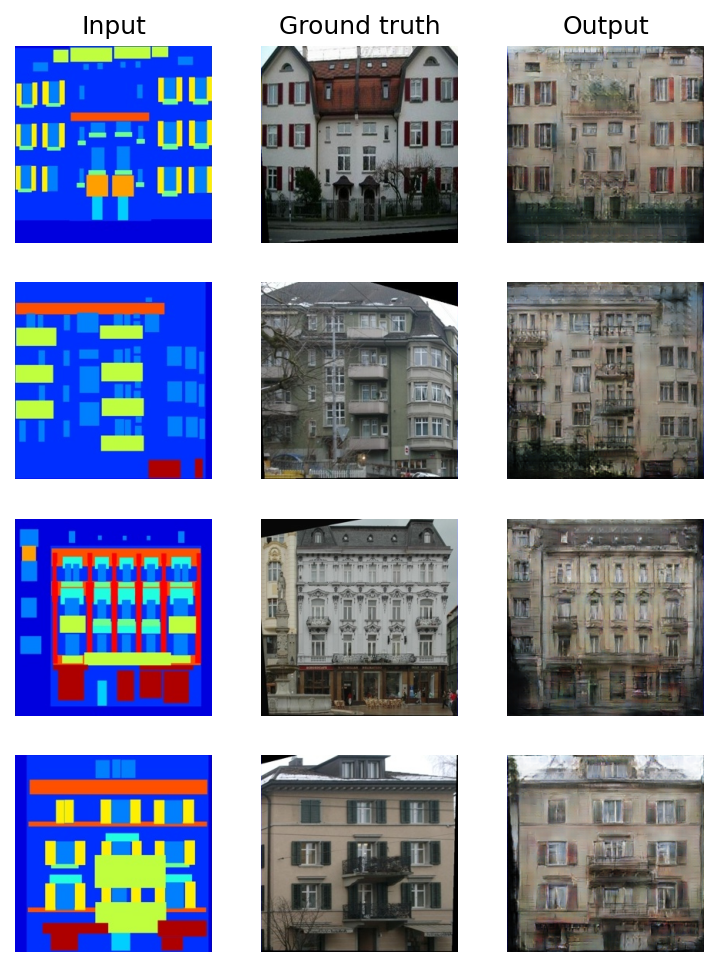

# Image-to-Image Translation with Conditional Adversarial Networks

Implementation in 100 lines of code of the paper [Image-to-Image Translation with Conditional Adversarial Networks](https://arxiv.org/abs/1611.07004).

## Usage

**Dataset:** [Download the training and testing datasets](https://github.com/junyanz/pytorch-CycleGAN-and-pix2pix/tree/master?tab=readme-ov-file#pix2pix-traintest).

```commandline
$ pip3 install -r requirements.txt
$ python3 pix2pix.py
```

## Results

#### Results of the method on facades labels→photo, compared to ground truth.


