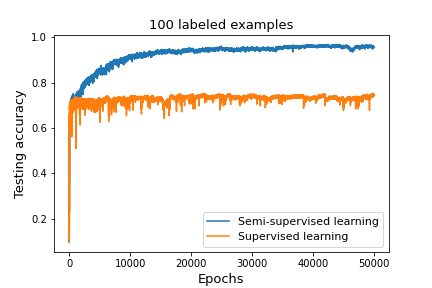

# Improved Techniques for Training GANs

Implementation in 100 lines of code of the paper [Improved Techniques for Training GANs](https://arxiv.org/abs/1606.03498).

## Usage

```commandline
$ pip3 install -r requirements.txt
$ python3 semi_supervised_learning.py
```

## Results

#### Testing accuracy on permutation invariant MNIST. 


