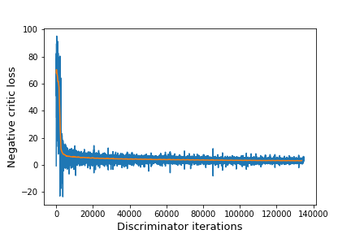

# Improved Training of Wasserstein GANs

Implementation in 100 lines of code of the paper [Improved Training of Wasserstein GANs](https://arxiv.org/abs/1704.00028).

## Usage

**Dataset:** [Download and extract the training dataset](https://github.com/fyu/lsun).

```commandline
$ pip3 install -r requirements.txt
$ python3 wgan.py
```

## Results

#### The negative critic loss of the model on LSUN bedrooms converges toward a minimum as the network trains.


#### Samples generated by the unsupervised model.


