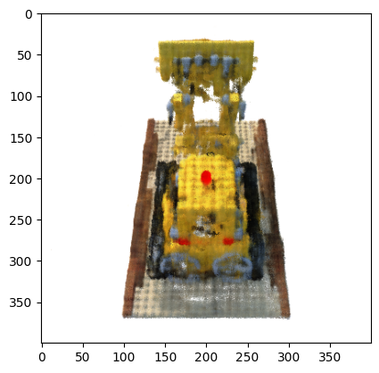
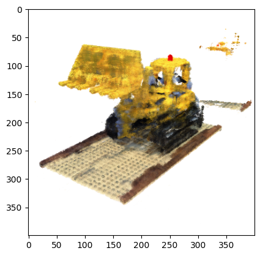
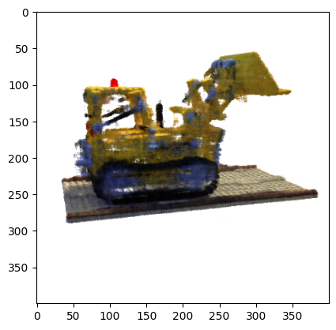
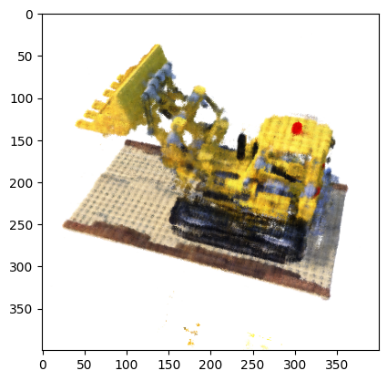

# InfoNeRF: Ray Entropy Minimization for Few-Shot Neural Volume Rendering


Implementation in 100 lines of code of the paper [InfoNeRF: Ray Entropy Minimization for Few-Shot Neural Volume Rendering](https://arxiv.org/abs/2112.15399).

## Usage

**Dataset:** [Download the training and testing datasets](https://drive.google.com/drive/folders/18bwm-RiHETRCS5yD9G00seFIcrJHIvD-?usp=sharing).
```commandline
$ pip3 install -r requirements.txt
$ python3 infonerf.py
```

## Results


#### Novel views rendered from the optimized model in 4-view settings


               |   
:-------------------------:|:-------------------------:
  |  

