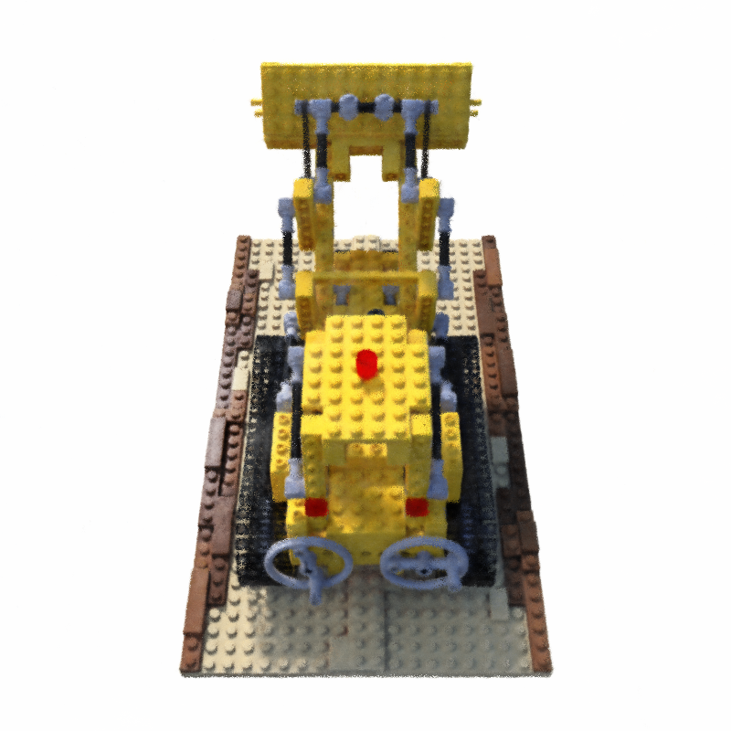
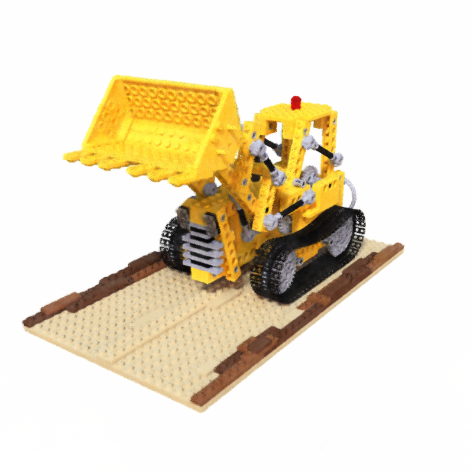
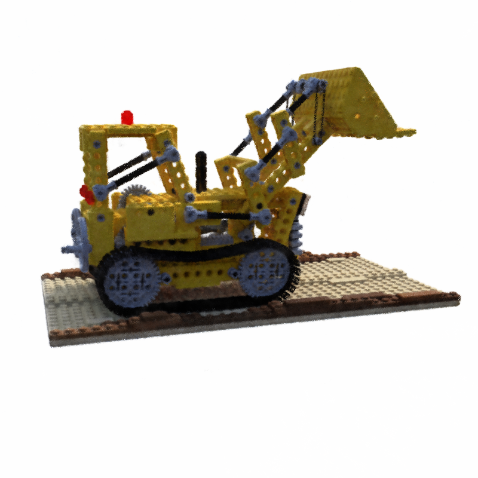
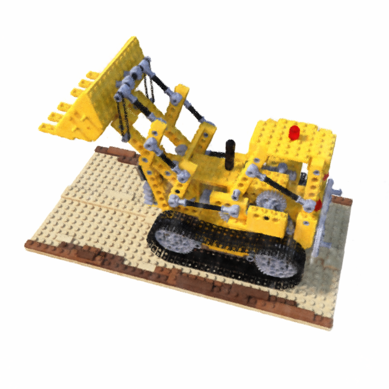

# Instant Neural Graphics Primitives with a Multiresolution Hash Encoding

Implementation in 100 lines of code of the paper [Instant Neural Graphics Primitives with a Multiresolution Hash Encoding](https://arxiv.org/abs/2201.05989).

## Usage

**Dataset:** [Download the training and testing datasets](https://drive.google.com/drive/folders/1eO7DXFhWWpauC-9LDhOimtIKxY3yRCIm?usp=sharing).

```commandline
$ pip3 install -r requirements.txt
$ python3 ngp.py
```

## Results

#### Novel views rendered from the optimized model

               |   
:-------------------------:|:-------------------------:
  |  


## What is not implemented

- Ray marching
- Occupancy grid