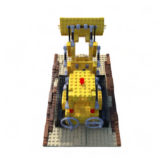
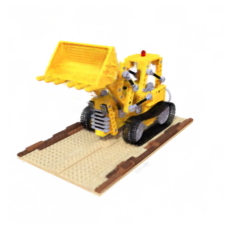
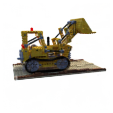
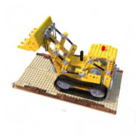

# KiloNeRF: Speeding up Neural Radiance Fields with Thousands of Tiny MLPs


Implementation in 100 lines of code of the paper [KiloNeRF: Speeding up Neural Radiance Fields with Thousands of Tiny MLPs](https://arxiv.org/abs/2103.13744).

## Usage

**Dataset:** [Download the training and testing datasets](https://drive.google.com/drive/folders/18bwm-RiHETRCS5yD9G00seFIcrJHIvD-?usp=sharing).
```commandline
$ pip3 install -r requirements.txt
$ python3 kilo_nerf.py
```

## Results


#### Novel views rendered from the optimized models


               |   
:-------------------------:|:-------------------------:
  |  


## What is not implemented

- Training with distillation
- Occupancy grid
- Custom cuda kernels