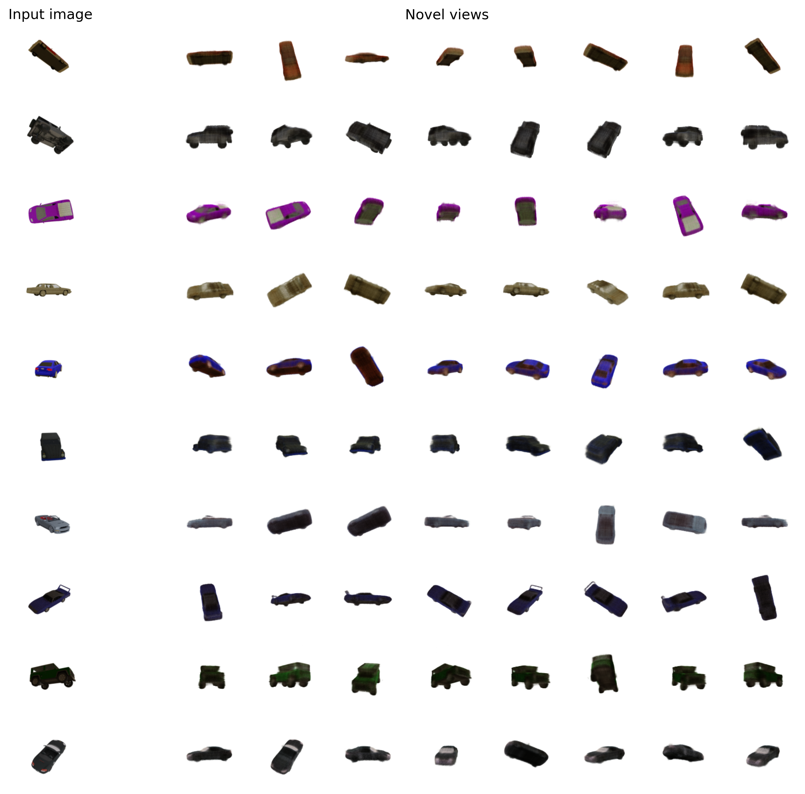

# Learned Initializations for Optimizing Coordinate-Based Neural Representations

Implementation in 100 lines of code of the paper [Learned Initializations for Optimizing Coordinate-Based Neural Representations](https://arxiv.org/abs/2012.02189).

## Usage

**Dataset:** [Download the car datasets](https://drive.google.com/drive/folders/1lRfg-Ov1dd3ldke9Gv9dyzGGTxiFOhIs), and put it inside the *data* folder.
```commandline
$ pip3 install -r requirements.txt
$ python3 nerf_mv.py
```

## Results


#### Single view reconstructions of ShapeNet objects.


 
