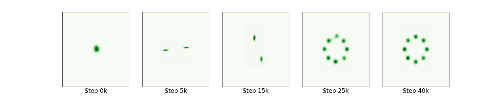

# Least Squares Generative Adversarial Networks

Implementation in 100 lines of code of the paper [Least Squares Generative Adversarial Networks](https://arxiv.org/abs/1611.04076).

## Usage

```commandline
$ pip3 install -r requirements.txt
$ python3 lsgan.py
```

## Results

#### Dynamic results of Gaussian kernel estimation for LSGANs. 


