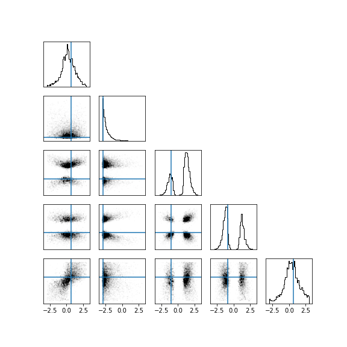

# Likelihood-free MCMC with Amortized Approximate Ratio Estimators

Implementation in 100 lines of code of the paper [Likelihood-free MCMC with Amortized Approximate Ratio Estimators](https://arxiv.org/abs/1903.04057).

## Usage

```commandline
$ pip3 install -r requirements.txt
$ python3 AALR-MCMC.py
```

## Results

#### Posterior distribution from the tractable benchmark.


