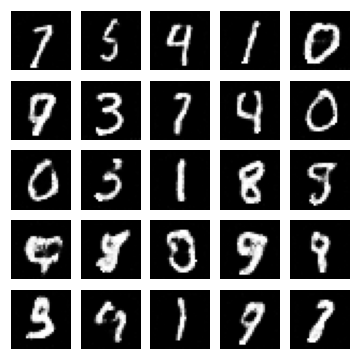

# Code for *Masked Autoregressive Flow for Density Estimation*

Implementation in 100 lines of code of the paper [Masked Autoregressive Flow for Density Estimation](https://arxiv.org/abs/1705.07057).

## Usage

```commandline
$ pip3 install -r requirements.txt
$ python3 maf.py
```

## Results

#### Visualization of samples from the model. 


