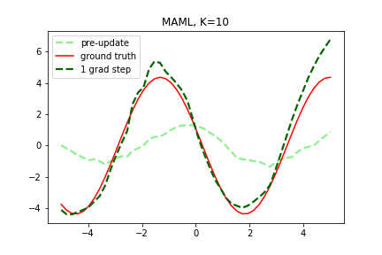

# Model-Agnostic Meta-Learning for Fast Adaptation of Deep Networks

Implementation in 100 lines of code of the paper [Model-Agnostic Meta-Learning for Fast Adaptation of Deep Networks
](https://arxiv.org/abs/1703.03400).

## Usage

```commandline
$ pip3 install -r requirements.txt
$ python3 maml.py
```

## Results

#### Few-shot adaptation on a simple regression task.


