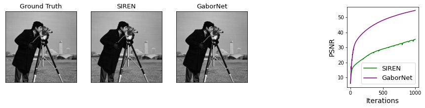

# Multiplicative Filter Networks

Implementation in 100 lines of code of the paper [Multiplicative Filter Networks](https://openreview.net/forum?id=OmtmcPkkhT).

## Usage

```commandline
$ pip3 install -r requirements.txt
$ python3 mfn.py
```

## Results

#### Fitting a ground truth image.


