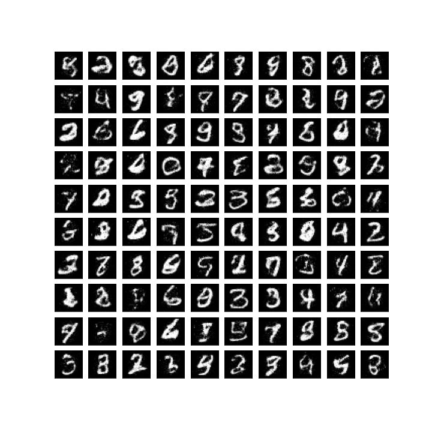

# NICE: Non-linear Independent Components Estimation

Implementation in 100 lines of code of the paper [NICE: Non-linear Independent Components Estimation](https://arxiv.org/abs/1410.8516).

## Usage

```commandline
$ pip3 install -r requirements.txt
$ python3 NICE.py
```

## Results

#### Unbiased samples from a trained NICE model. 


