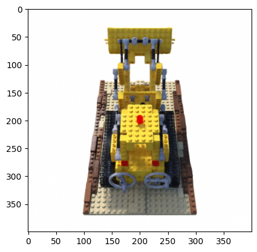
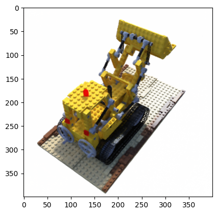
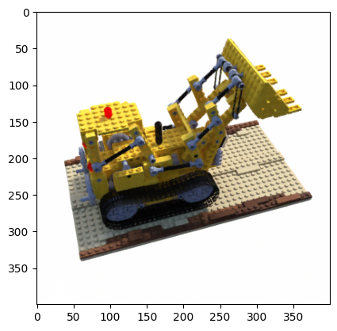
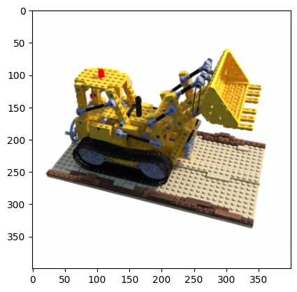
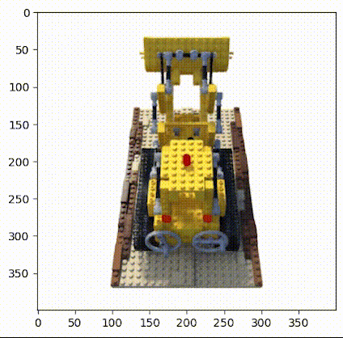

# NeRF: Representing Scenes as Neural Radiance Fields for View Synthesis

Implementation in 100 lines of code of the paper [NeRF: Representing Scenes as Neural Radiance Fields for View Synthesis
](https://arxiv.org/abs/2003.08934).

## Usage

**Dataset:** [Download the training and testing datasets](https://drive.google.com/drive/folders/18bwm-RiHETRCS5yD9G00seFIcrJHIvD-?usp=sharing) and save in `data` folder.
```commandline
$ conda create -n nerf --python=3.10
$ conda activate nerf
$ pip3 install -r requirements.txt
$ mkdir data && cd data
$ gdown 1hH7NhaXxIthO9-FeT16fvpf_MVIhf41J  
$ gdown 16M64h0KKgFKhM8hJDpqd15YWYhafUs2Q 
$ python3 nerf.py
```

## Results


#### Novel views rendered from the optimized NeRF representation


               |   
:-------------------------:|:-------------------------:
  |  




## Credits

- The datasets were generated with the code from [kwea123/nerf_pl](https://github.com/kwea123/nerf_pl/blob/master/datasets/blender.py).
- The training hyperparameters were retrieved from [kwea123/nerf_pl](https://github.com/kwea123/nerf_pl).

## What is not implemented

- Hierarchical volume sampling