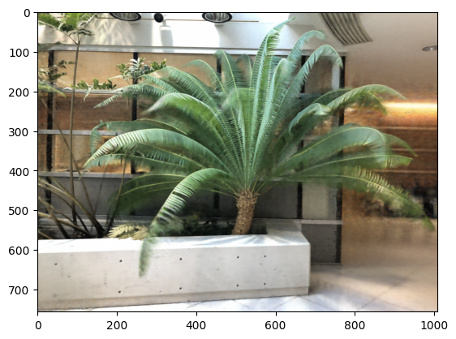

# NeRF--: Neural Radiance Fields Without Known Camera Parameters

Implementation in 100 lines of code of the paper [NeRF--: Neural Radiance Fields Without Known Camera Parameters](https://arxiv.org/abs/2102.07064).

## Usage

**Dataset:** [Download the training datasets](https://drive.google.com/drive/folders/128yBriW1IG_3NJ5Rp7APSTZsJqdJdfc1).
```commandline
$ pip3 install -r requirements.txt
$ python3 nerfmm.py
```

## Results


#### Novel view rendered from the optimized model


 