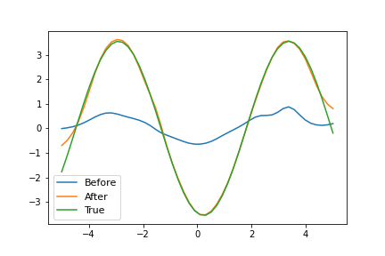

# On First-Order Meta-Learning Algorithms

Implementation in 100 lines of code of the paper [On First-Order Meta-Learning Algorithms](https://arxiv.org/abs/1803.02999).

## Usage

```commandline
$ pip3 install -r requirements.txt
$ python3 reptile.py
```

## Results

#### Demonstration of Reptile on a toy few-shot regression problem.


