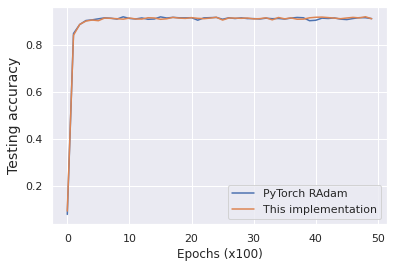

# On the Variance of the Adaptive Learning Rate and Beyond

Implementation in 100 lines of code of the paper [RAdam](https://arxiv.org/abs/1908.03265).

## Usage

```commandline
$ pip3 install -r requirements.txt
$ python3 radam.py
```

## Results

#### Test accuracy


