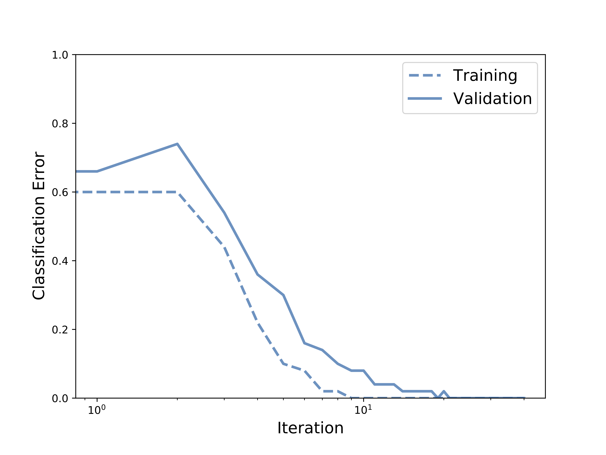

# Optimizing Millions of Hyperparameters by Implicit Differentiation

Implementation in 100 lines of code of the paper [Optimizing Millions of Hyperparameters by Implicit Differentiation](http://proceedings.mlr.press/v108/lorraine20a/lorraine20a.pdf).

## Usage

```commandline
$ pip3 install -r requirements.txt
$ python3 gradient_based_HO.py
```

## Results

#### Overfitting a Small Validation Set


