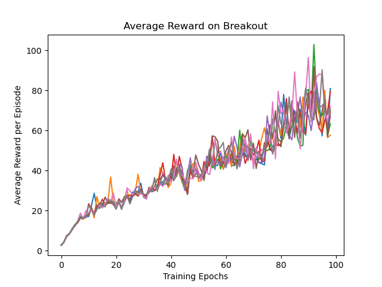

# Proximal Policy Optimization Algorithms

Implementation in 100 lines of code of the paper [Proximal Policy Optimization Algorithms](https://arxiv.org/abs/1707.06347).


## Usage

```commandline
$ pip3 install -r requirements.txt
$ python3 ppo.py
```

## Results


#### Average reward on Breakout


