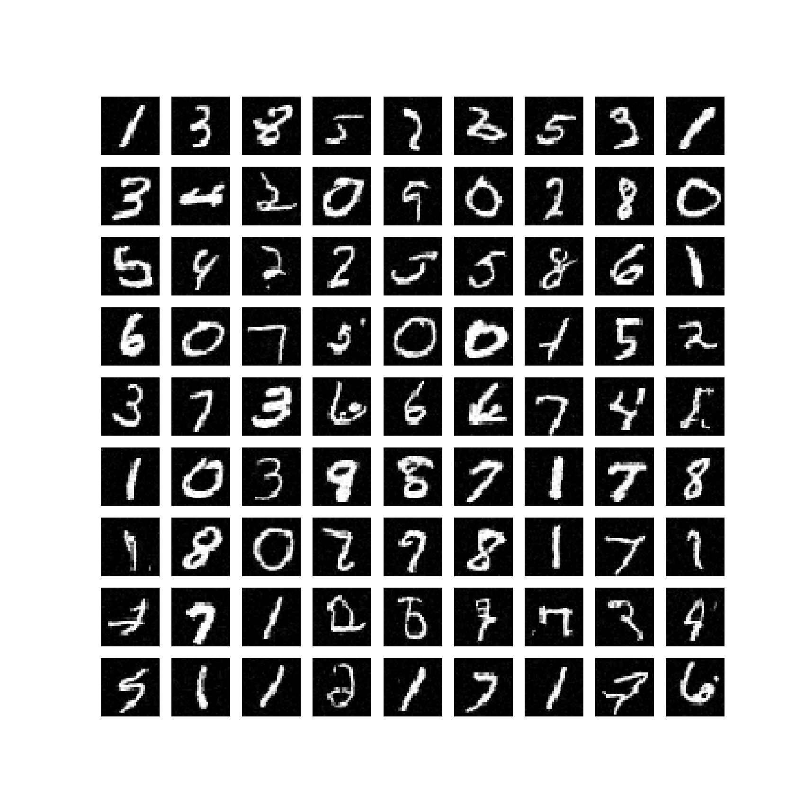

# DPM-Solver


Implementation in 100 lines of code of the paper [Pseudo Numerical Methods for Diffusion Models on Manifolds](https://arxiv.org/abs/2202.09778).

## Usage

```commandline
$ pip3 install -r requirements.txt
$ python3 pndms_solver.py
```

## Results


#### Generated samples


 
