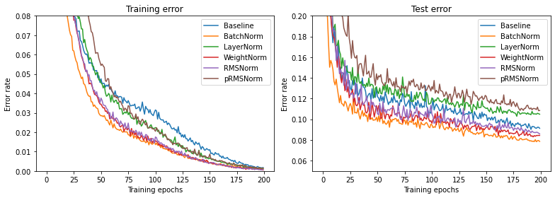

# Root Mean Square Layer Normalization


Implementation in 100 lines of code of the paper [Root Mean Square Layer Normalization](https://arxiv.org/abs/1910.07467).

## Usage

```commandline
$ pip3 install -r requirements.txt
$ python3 rmsnorm.py
```

## Results


#### Training and test error rate for the ConvPool-CNN-C model on CIFAR-10.


 
