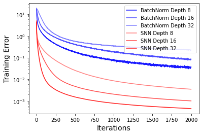

# Self-Normalizing Neural Networks

Implementation in 100 lines of code of the paper [Self-Normalizing Neural Networks](https://arxiv.org/abs/1706.02515).

## Usage

```commandline
$ pip3 install -r requirements.txt
$ python3 selu.py
```

## Results


#### Training error for feed-forward neural networks with batch normalization and self-normalizing networks on the MNIST dataset.


 
