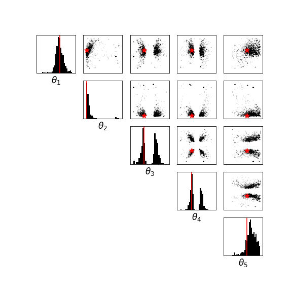

# Sequential Neural Likelihood: Fast Likelihood-free Inference with Autoregressive Flows

Implementation in 100 lines of code of the paper [Sequential Neural Likelihood:
Fast Likelihood-free Inference with Autoregressive Flows](https://arxiv.org/abs/1805.07226).

## Usage

```commandline
$ pip3 install -r requirements.txt
$ python3 snl.py
```

## Results

#### MCMC samples from SNL posterior.


