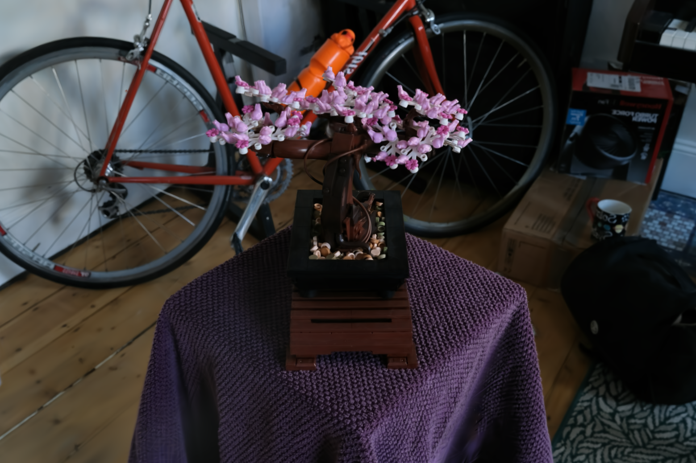
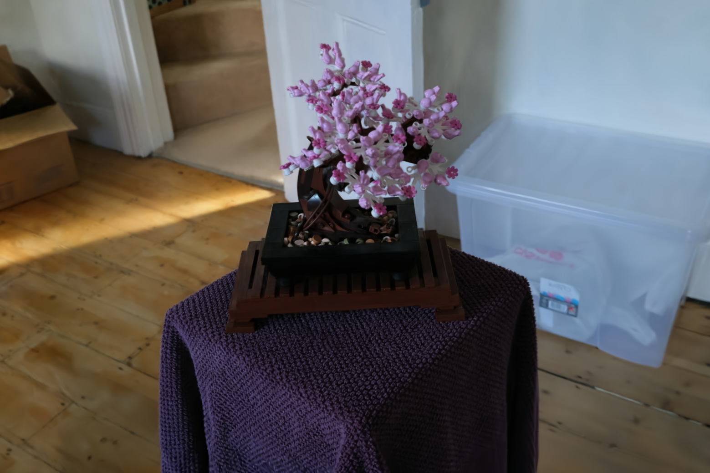
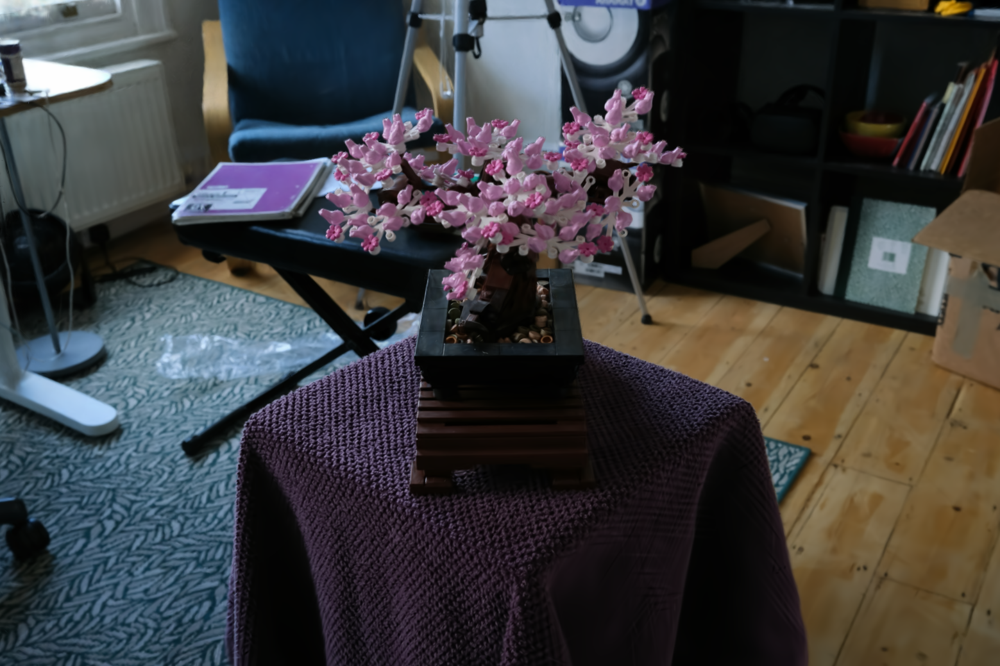
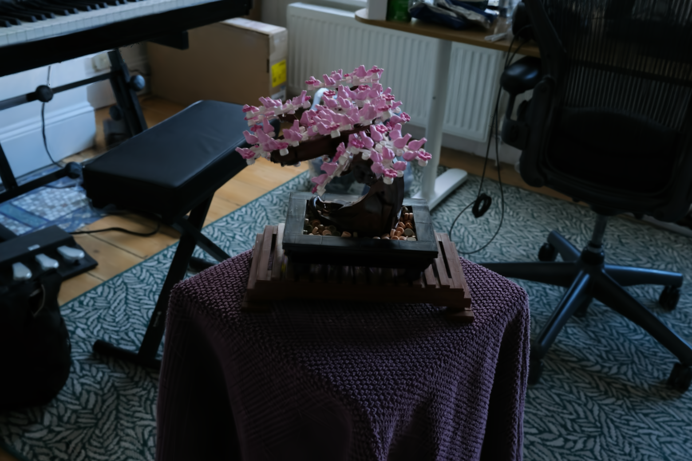

# Spherical Voronoi: Directional Appearance as a Differentiable Partition of the Sphere

#### Inference code from the course [3D Gaussian Splatting from Scratch — PyTorch-Only](https://3dgaussiansplattingcourse.com).

## Usage

[Download the trained gaussians](https://drive.google.com/file/d/1jN2F7n2PR08BlRRP33V9SrIDlmGrQgAU/view?usp=sharing).
```commandline
$ pip3 install -r requirements.txt
$ python3 3dgs_sv.py
```

## Results

#### Novel views rendered from the optimized 3DGS representation (after 30k training iterations)

               |   
:-------------------------:|:-------------------------:
  |  