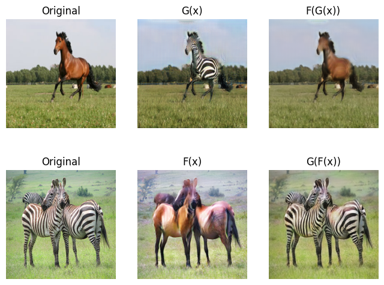

# CycleGAN

Implementation in 100 lines of code of the paper [Unpaired Image-to-Image Translation using Cycle-Consistent Adversarial Networks](https://arxiv.org/abs/1703.10593).

## Usage

**Dataset:** [Download and extract the training dataset](https://github.com/junyanz/pytorch-CycleGAN-and-pix2pix).

```commandline
$ pip3 install -r requirements.txt
$ python3 cycle_gan.py
```

## Results

#### Example results of CycleGAN on unpaired dataset (zebra↔horse).


