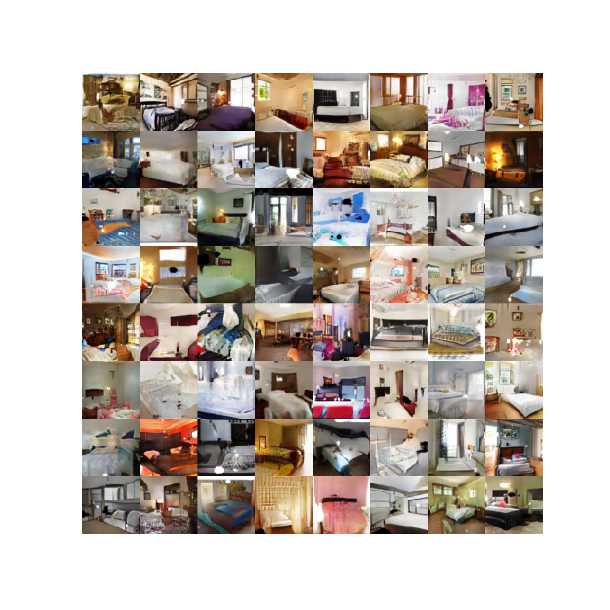

# Unsupervised Representation Learning with Deep Convolutional Generative Adversarial Networks

Implementation in 100 lines of code of the paper [Unsupervised Representation Learning with Deep Convolutional Generative Adversarial Networks](https://arxiv.org/abs/1511.06434).

## Usage

**Dataset:** [Download the training and testing datasets](https://github.com/fyu/lsun).
```commandline
$ pip3 install -r requirements.txt
$ python3 conv_gan.py
```

## Results

#### Generated bedrooms after one epoch of training.


#### Generated bedrooms after five epochs of training.


