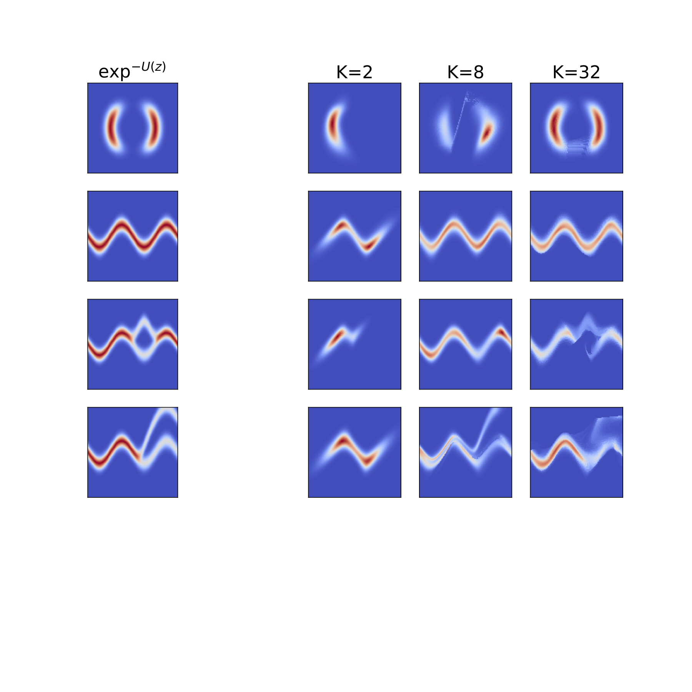

# Variational Inference with Normalizing Flows

Implementation in 100 lines of code of the paper [Variational Inference with Normalizing Flows](https://arxiv.org/abs/1505.05770).

## Usage

```commandline
$ pip3 install -r requirements.txt
$ python3 Flows.py
```

## Results

#### Visualization of samples from the model. 


