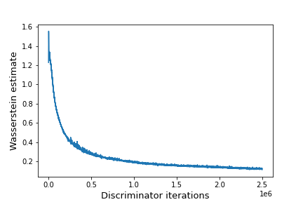

# Wasserstein GAN

Implementation in 100 lines of code of the paper [Wasserstein GAN](https://arxiv.org/abs/1701.07875).

## Usage

**Dataset:** [Download and extract the training dataset](https://github.com/fyu/lsun).

```commandline
$ pip3 install -r requirements.txt
$ python3 wgan.py
```

## Results

#### Wasserstein estimate.


#### Samples from the WGAN algorithm trained with a DCGAN generator.


